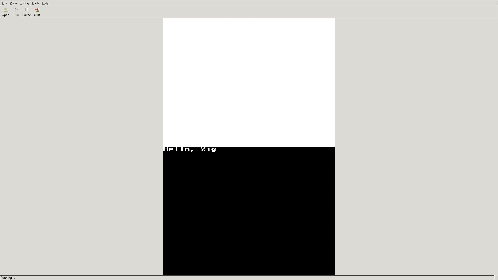

# zig-nds



## Getting started

- [zig](https://ziglang.org/download/)
- [devkitPro](https://devkitpro.org/wiki/Getting_Started)

```
pacman -S nds-dev
git clone https://github.com/zig-homebrew/zig-nds
cd zig-nds/
zig build # then run zig-out/zig-nds.nds with desmume
```

## Resources

- [nds-examples](https://github.com/devkitPro/nds-examples)
- [libnds repository](https://github.com/devkitPro/libnds)
- [libnds documentation](https://libnds.devkitpro.org/files.html)
- [GBATEK](https://problemkaputt.de/gbatek.htm)
